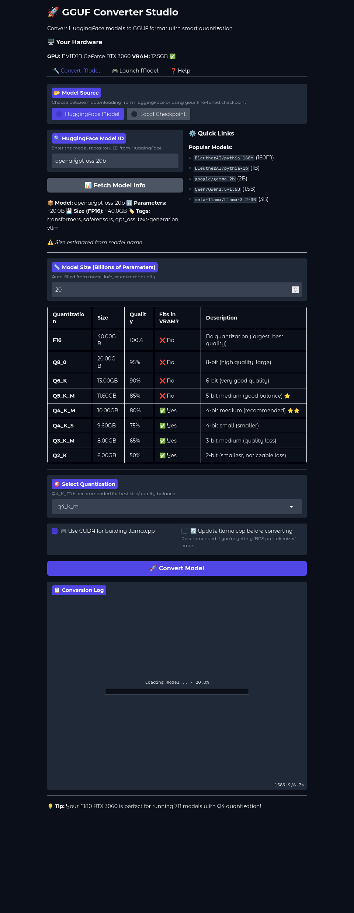

# 🚀 GGUF Converter Studio

Convert HuggingFace models and fine-tuned checkpoints to GGUF format for blazing-fast local inference with llama.cpp. Features both a powerful CLI and an intuitive GUI.


## ✨ Features

- **🎯 Dual Interface**: Choose between CLI power-user tools or a beautiful Gradio GUI
- **📦 HuggingFace Integration**: Download and convert any compatible model
- **🔧 LoRA Support**: Automatically detects and merges LoRA adapters
- **⚡ Smart Quantization**: 8 quantization levels from F16 to Q2_K with size/quality tradeoffs
- **🎮 VRAM Calculator**: Visual tool to see which quantization fits your GPU
- **🔨 Auto-Building**: Clones, updates, and builds llama.cpp automatically
- **🚀 One-Click Launch**: Built-in llama-server launcher with browser integration

## 🖼️ Screenshots

### GUI Interface

*Smart quantization recommendations based on your hardware*

### CLI Output
```bash
$ python convert_to_gguf.py --hf EleutherAI/pythia-160m --quant q4_k_m
============================================================
RhizomeML to GGUF Converter
============================================================
🔧 Using Hugging Face model: EleutherAI/pythia-160m
📥 Downloading model...
✅ Model downloaded!
🔄 Converting to GGUF format...
✅ GGUF conversion complete!
🎯 Quantizing to Q4_K_M...
✅ Quantization complete: 95.2MB → 47.6MB (50% reduction)
============================================================
✅ CONVERSION COMPLETE!
============================================================
```

## 📋 Requirements

### Core Dependencies
```bash
pip install torch transformers peft accelerate sentencepiece huggingface_hub
```

### GUI Dependencies (optional)
```bash
pip install gradio psutil
```

### System Requirements
- **Python**: 3.8+
- **CMake**: For building llama.cpp
- **Git**: For cloning repositories
- **CUDA** (optional): For GPU acceleration

#### Installing CMake
```bash
# Ubuntu/Debian
sudo apt install cmake build-essential

# Fedora
sudo dnf install cmake gcc-c++

# Arch
sudo pacman -S cmake base-devel

# macOS
brew install cmake
```

## 🚀 Quick Start

### Option 1: GUI (Recommended for Beginners)

```bash
python gguf_gui.py
```

This launches a web interface at `http://localhost:7860` with:
- Visual model browser
- VRAM compatibility checker
- Quantization recommendations
- One-click conversion and launch

### Option 2: CLI (Power Users)

#### Convert a HuggingFace Model
```bash
python convert_to_gguf.py --hf EleutherAI/pythia-160m --quant q4_k_m
```

#### Convert Your Fine-Tuned Checkpoint
```bash
# Auto-detect latest checkpoint
python convert_to_gguf.py --quant q4_k_m

# Specific checkpoint
python convert_to_gguf.py --checkpoint checkpoint-2100 --quant q5_k_m
```

#### Update llama.cpp (Fixes "BPE pre-tokenizer" errors)
```bash
python convert_to_gguf.py --update --hf EleutherAI/pythia-160m
```

## 📖 Usage Guide

### CLI Examples

#### Download and Convert with Maximum Quality
```bash
python convert_to_gguf.py --hf meta-llama/Llama-2-7b --quant q8_0
```

#### Convert Fine-Tuned Model with CPU-Only Build
```bash
python convert_to_gguf.py --checkpoint checkpoint-1500 --cpu --quant q4_k_m
```

#### Custom Base Model Override
```bash
python convert_to_gguf.py --checkpoint my-adapter --base-model meta-llama/Llama-2-7b
```

#### Keep Intermediate Files
```bash
python convert_to_gguf.py --hf model-id --keep-merged --keep-f16
```

### GUI Workflow

1. **Launch GUI**: `python gguf_gui.py`
2. **Choose Source**:
   - HuggingFace Model: Enter model ID (e.g., `EleutherAI/pythia-160m`)
   - Local Checkpoint: Select from your fine-tuned models
3. **Fetch Info**: Click "Fetch Model Info" to see size/parameters
4. **Select Quantization**: View the table and choose based on your VRAM
5. **Convert**: Click "Convert Model" and monitor progress
6. **Launch**: Switch to "Launch Model" tab and run your model!

## 🎯 Quantization Guide

| Type | Size Ratio | Quality | Best For |
|------|-----------|---------|----------|
| **F16** | 100% | 100% | Best quality, largest size |
| **Q8_0** | 50% | 95% | High quality, still large |
| **Q6_K** | 33% | 90% | Very good quality |
| **Q5_K_M** ⭐ | 29% | 85% | Great balance |
| **Q4_K_M** ⭐⭐ | 25% | 80% | **Recommended** |
| **Q4_K_S** | 24% | 75% | Smaller variant |
| **Q3_K_M** | 20% | 65% | Noticeable quality loss |
| **Q2_K** | 15% | 50% | Testing/demos only |

### Example: 7B Model Sizes
- **F16**: ~14GB (won't fit 12GB GPU)
- **Q8_0**: ~7GB
- **Q5_K_M**: ~4.8GB
- **Q4_K_M**: ~3.5GB ✅ **Fits 4GB GPU!**
- **Q2_K**: ~2GB

## 🔧 Configuration

### HuggingFace Token
For private/gated models, set your token in `convert_to_gguf.py`:
```python
config = {
    "HF_TOKEN": "hf_your_token_here",
}
```

Or set as environment variable:
```bash
export HF_TOKEN="hf_your_token_here"
```

### Custom Paths
```bash
python convert_to_gguf.py \
  --finetuned-dir ./my-checkpoints \
  --gguf-dir ./my-gguf-models \
  --llama-cpp ./custom/llama.cpp
```

## 📁 Project Structure

```
.
├── convert_to_gguf.py      # CLI conversion script
├── gguf_gui.py              # Gradio GUI application
├── RhizomeML-finetuned/     # Your fine-tuned checkpoints
├── gguf_models/             # Output GGUF files
├── llama.cpp/               # Auto-cloned and built
├── merged_model/            # Temporary LoRA merge directory
└── hf_models/               # Downloaded HuggingFace models
```

## 🎮 Running Models

### Generated Run Script
After conversion, a convenience script is created:
```bash
./gguf_models/run_model-name.sh
```

### Manual Launch
```bash
# Full GPU offload
./llama.cpp/build/bin/llama-server -m model.gguf -c 8192 -ngl 99

# Hybrid (attention on GPU, FFN on CPU)
./llama.cpp/build/bin/llama-server -m model.gguf -c 8192 -ngl 99 \
  -ot "*attn.*=GPU,*ffn_.*=CPU" --threads 14

# CPU only
./llama.cpp/build/bin/llama-server -m model.gguf -c 8192 --threads 14
```

Server runs at `http://localhost:8081` with:
- Web chat interface
- OpenAI-compatible API endpoint
- Parameter controls (temperature, top-p, etc.)

## 🐛 Troubleshooting

### "BPE pre-tokenizer" Error
```bash
python convert_to_gguf.py --update --hf your-model-id
```
This updates llama.cpp to the latest version.

### "CMake not found"
Install CMake for your platform (see Requirements section).

### "Model architecture not supported"
Some models aren't supported by llama.cpp. Try:
- GPT-NeoX/Pythia models (well supported)
- Llama, Mistral, Qwen families (excellent support)
- Avoid: GPT-Neo (often unsupported)

### GPU Out of Memory During Merge
```bash
python convert_to_gguf.py --device cpu --checkpoint your-checkpoint
```

### Quantized Model Not Created
The script falls back to F16 if quantization fails. Check:
1. llama.cpp built successfully?
2. Try `--update` flag
3. Check disk space

## 💡 Tips & Best Practices

1. **Start with Q4_K_M**: Best balance for most use cases
2. **Use --update**: If you get conversion errors
3. **Test Before Quantizing**: Use F16 first, then quantize if it works
4. **Monitor VRAM**: Use GUI's calculator or `nvidia-smi`
5. **Hybrid Offload**: Use GPU for attention, CPU for FFN layers to fit larger models

## 🤝 Contributing

Contributions welcome! Areas for improvement:
- Support for more model architectures
- Better error handling and recovery
- Model performance benchmarking
- Cloud deployment guides

## 📄 License

MIT License - feel free to use in your projects!

## 🙏 Acknowledgments

- **[llama.cpp](https://github.com/ggerganov/llama.cpp)**: The amazing inference engine
- **[HuggingFace](https://huggingface.co)**: Model hosting and transformers library
- **[Gradio](https://gradio.app)**: Beautiful GUI framework

## 📞 Support

- **Issues**: [GitHub Issues](your-repo/issues)
- **Discussions**: [GitHub Discussions](your-repo/discussions)
- **Documentation**: [Wiki](your-repo/wiki)

---

**Made with ❤️ for the local LLM community**

*Run models on your hardware, your terms.*
